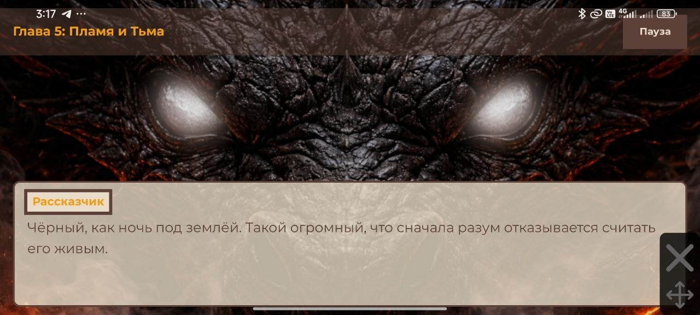
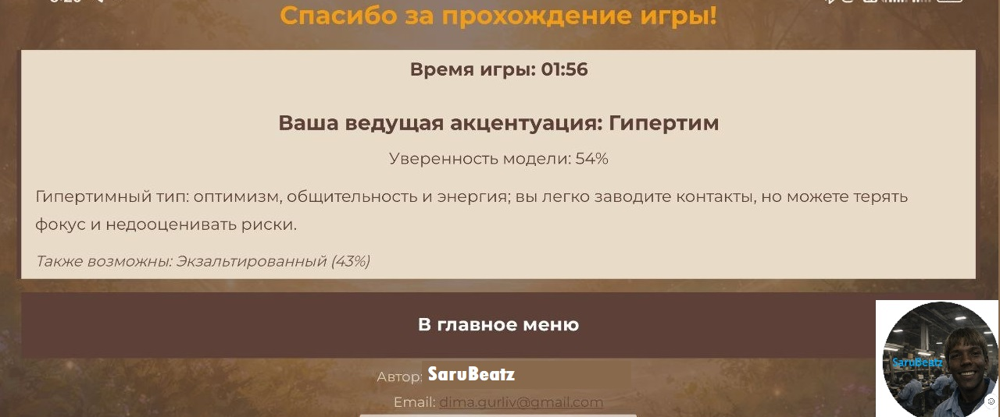
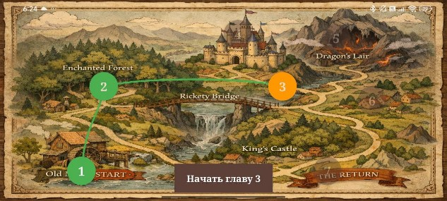
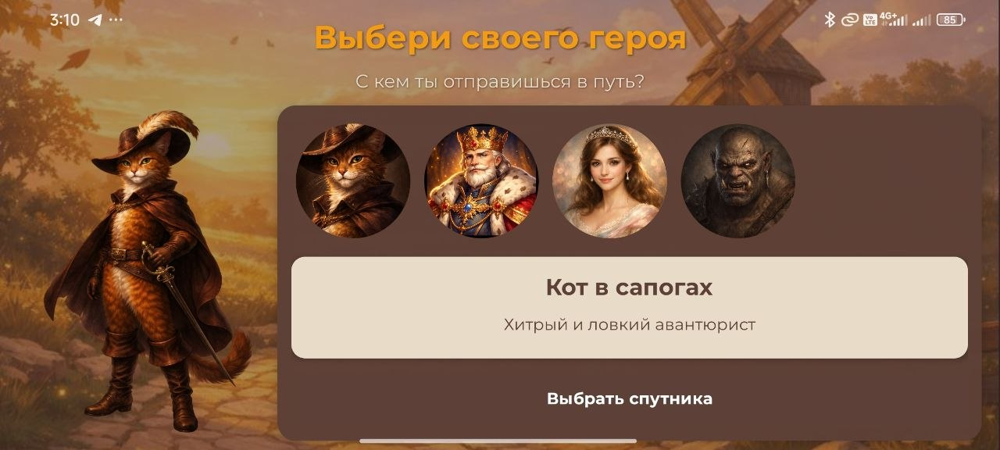

<!-- EN -->
# English (En)
<div align="center">


# Saga of the Aylopors

<p>A mobile visual novel application with an integrated Web CRM panel for game state administration and telemetry analytics.</p>

<p>
  <a href="https://developer.android.com"></a>
  <a href="https://www.java.com"></a>
  <a href="LICENSE"></a>
</p>

</div>

> **Localization Status:**
> - **Russian (RU):** Fully supported (100%).
> - **English (EN):** Core UI and system controls translated (~10%). Narrative dialogue trees and story scenarios are stored in JSON assets in Russian (translation in progress).

---

## Download

<div align="center">
  <table>
    <tr>
      <td align="center">
        <b>Production Release (Latest)</b><br /><br />
        <a href="https://github.com/SaruBeatz/SagaOfTheAylopors/releases/latest">
          
        </a>
        <br /><br />
        <sub>Direct package download via GitHub Releases</sub>
      </td>
      <td align="left">
        <b>System Requirements:</b>
        <ul>
          <li>Operating System: Android 8.0 (API Level 26) or higher (Min SDK 24)</li>
          <li>RAM: 2 GB minimum</li>
          <li>Storage: 250 MB free internal space</li>
          <li>Display: 16:9 or 19.5:9 aspect ratio recommended</li>
        </ul>
      </td>
    </tr>
  </table>
</div>

---

## Showcase & Media

<table width="100%">
  <tr>
    <th width="50%" align="center">Interactive Narrative & Dialogue Engine</th>
    <th width="50%" align="center">On-Device ML Inference (Finale Screen)</th>
  </tr>
  <tr>
    <td align="center" valign="top">
      
      <p><sub>Dynamic scene rendering, character portraits, and dialogue choice state machine.</sub></p>
    </td>
    <td align="center" valign="top">
      
      <p><sub>Real-time personality accentuation inference based on collected playthrough vector.</sub></p>
    </td>
  </tr>
  <tr>
    <th width="50%" align="center">Interactive World Map</th>
    <th width="50%" align="center">Companion Selection</th>
  </tr>
  <tr>
    <td align="center" valign="top">
      
      <p><sub>Non-linear chapter navigation and progression checkpoint tracking.</sub></p>
    </td>
    <td align="center" valign="top">
      
      <p><sub>Initial parameter configuration and companion narrative branch selection.</sub></p>
    </td>
  </tr>
</table>

<table width="100%">
  <tr>
    <th width="50%" align="center">Video: Gameplay Demonstration (2 min)</th>
    <th width="50%" align="center">Video: Web CRM & Analytics Overview (2:47 min)</th>
  </tr>
  <tr>
    <td align="center" valign="middle">
      <p>Accelerated playthrough showing branching dialogues, scene transitions, and audio sync.</p>
      <a href="https://drive.google.com/file/d/1wd1RnKTcseiWMnl8d4VPOuZs6BlBUsXE/view?usp=sharing">
        
      </a>
      <br /><br />
      <sub>Direct video link</sub>
    </td>
    <td align="center" valign="middle">
      <p>Administrative dashboard walkthrough, session inspection, and decision telemetry.</p>
      <a href="https://drive.google.com/file/d/1uxai0oRfaK1mo5_1G8R5QAPo2TDrsTK_/view?usp=sharing">
        
      </a>
      <br /><br />
      <sub>Direct video link</sub>
    </td>
  </tr>
</table>
---

## Features & Architecture

### Client Application (Mobile Game)
- **Deterministic Narrative Engine:** State-machine-driven narrative processing based on structured JSON scenario schemas.
- **Audio Lifecycle Synchronization:** Background audio manager synchronized with Android activity lifecycle transitions and audio focus events.
- **Choice Tracking & Persistence:** Local storage of user progression, relationship variables, and decision history.

### Administrative Panel (Web CRM) 
- **Telemetry Aggregation:** Ingestion and visualization of aggregated gameplay choices and drop-off rates.
- **Session Auditing:** Inspection of player trajectories and decision branch distribution.

---

## Tech Stack

<table>
  <tr>
    <td width="20%"><b>Core Platform</b></td>
    <td>
      <code>Android SDK</code> &bull; <code>Java 17</code> &bull; <code>Gradle</code>
    </td>
  </tr>
  <tr>
    <td width="20%"><b>Data & Serialization</b></td>
    <td>
      <code>JSON Schema Parsing</code> &bull; <code>Room Persistence Library</code> &bull; <code>SQLite</code>
    </td>
  </tr>
  <tr>
    <td width="20%"><b>Networking</b></td>
    <td>
      <code>REST API</code> &bull; <code>HTTP Client Integration</code>
    </td>
  </tr>
  <tr>
    <td width="20%"><b>Telemetry / CRM</b></td>
    <td>
      <code>Cloud Telemetry Sync</code> &bull; <code>Web Dashboard Client</code>
    </td>
  </tr>
</table>

---

## Building from Source

### Prerequisites
- JDK 17
- Android Studio Ladybug (2024.2.1+) or newer
- Git 2.30+

### Steps

1. Clone the repository:
   ```bash
   git clone https://github.com/SaruBeatz/SagaOfTheAylopors.git
   cd SagaOfTheAylopors
   ```

2. Synchronize and refresh dependencies:
   ```bash
   ./gradlew build --refresh-dependencies
   ```

3. Build debug APK:
   ```bash
   ./gradlew assembleDebug
   ```
   The compiled APK binary will be located at: `app/build/outputs/apk/debug/app-debug.apk`

---
<!-- RU -->
# Russian (RU)
<div align="center">


<p>Сага Айлопороса - Мобильная игра в жанре визуальной новеллы с интегрированной веб-панелью CRM для администрирования и аналитики.</p>

<p>
  <a href="https://developer.android.com"></a>
  <a href="https://www.java.com"></a>
  <a href="LICENSE"></a>
</p>

</div>

> **Статус локализации:**
> - **Русский язык (RU):** Полная поддержка (100%).
> - **Английский язык (EN):** Переведен базовый системный интерфейс и элементы управления (~10%). Сюжетные ветвления и диалоговые деревья хранятся в JSON-файлах на русском языке (локализация в процессе реализации).

---

## Загрузка

<div align="center">
  <table>
    <tr>
      <td align="center">
        <b>Релизная версия (Актуальная)</b><br /><br />
        <a href="https://github.com/SaruBeatz/SagaOfTheAylopors/releases/latest">
          
        </a>
        <br /><br />
        <sub>Прямая загрузка дистрибутива через GitHub Releases</sub>
      </td>
      <td align="left">
        <b>Системные требования:</b>
        <ul>
          <li>Операционная система: Android 8.0 (API Level 26) и выше (Min SDK 24)</li>
          <li>Оперативная память: от 2 ГБ</li>
          <li>Накопитель: не менее 250 МБ свободного пространства</li>
          <li>Экран: рекомендовано соотношение сторон 16:9 или 19.5:9</li>
        </ul>
      </td>
    </tr>
  </table>
</div>

---

## Демонстрация и медиа

<table width="100%">
  <tr>
    <th width="50%" align="center">Сценарный движок и система диалогов</th>
    <th width="50%" align="center">Инференс ML на устройстве (Экран финала)</th>
  </tr>
  <tr>
    <td align="center" valign="top">
      
      <p><sub>Динамический рендеринг сцен, отображение реплик и расчет развилок выбора.</sub></p>
    </td>
    <td align="center" valign="top">
      
      <p><sub>Офлайн-классификация акцентуаций личности по вектору принятых решений.</sub></p>
    </td>
  </tr>
  <tr>
    <th width="50%" align="center">Карта мира</th>
    <th width="50%" align="center">Выбор спутника</th>
  </tr>
  <tr>
    <td align="center" valign="top">
      
      <p><sub>Навигация по главам и сохранение контрольных точек прохождения.</sub></p>
    </td>
    <td align="center" valign="top">
      
      <p><sub>Конфигурация начальных параметров и выбор сюжетной линии спутника.</sub></p>
    </td>
  </tr>
</table>

<table width="100%">
  <tr>
    <th width="50%" align="center">Видео: Демонстрация геймплея (2 мин)</th>
    <th width="50%" align="center">Видео: Обзор Web CRM и аналитики (2:40 мин)</th>
  </tr>
  <tr>
    <td align="center" valign="middle">
      <p>Ускоренное прохождение игры: развилки сюжета, смена глав и работа звука.</p>
      <a href="https://drive.google.com/file/d/1wd1RnKTcseiWMnl8d4VPOuZs6BlBUsXE/view?usp=sharing">
        
      </a>
      <br /><br />
      <sub>Прямая ссылка на просмотр видео</sub>
    </td>
    <td align="center" valign="middle">
      <p>Обзор административной веб-панели, аудит сессий и телеметрия решений игроков.</p>
      <a href="https://drive.google.com/file/d/1uxai0oRfaK1mo5_1G8R5QAPo2TDrsTK_/view?usp=sharing">
        
      </a>
      <br /><br />
      <sub>Прямая ссылка на просмотр видео</sub>
    </td>
  </tr>
</table>

---

## Возможности и архитектура

### Клиентское приложение (Мобильная игра)
- **Сценарный движок:** Обработка структуры сценария на базе конечных автоматов с загрузкой из структурированных JSON-схем.
- **Аудио:** Фоновый звуковой контроллер, синхронизированный с жизненным циклом компонентов Android и получением аудиофокуса.
- **Логика взаимодействий:** Локальное сохранение переменных прогресса, взаимоотношений персонажей и дерева решений.

### Административная панель (Web CRM)
- **Сбор поведенческих характеристик (телеметрия):** Агрегация и визуализация выборов пользователей, анализ точек оттока и популярных сценарных веток.
- **Аудит игровых сессий:** Мониторинг прохождений конкретных пользователей и валидация целостности данных.


---

## Стек технологий

<table>
  <tr>
    <td width="20%"><b>Базовая платформа</b></td>
    <td>
      <code>Android SDK</code> &bull; <code>Java 17</code> &bull; <code>Gradle</code>
    </td>
  </tr>
  <tr>
    <td width="20%"><b>Хранение данных</b></td>
    <td>
      <code>JSON Schema Parsing</code> &bull; <code>Room Persistence Library</code> &bull; <code>SQLite</code>
    </td>
  </tr>
  <tr>
    <td width="20%"><b>Сетевой протокол</b></td>
    <td>
      <code>REST API</code> &bull; <code>HTTP Client Integration</code>
    </td>
  </tr>
  <tr>
    <td width="20%"><b>Телеметрия и CRM</b></td>
    <td>
      <code>Cloud Telemetry Sync</code> &bull; <code>Web Dashboard Client</code>
    </td>
  </tr>
</table>

---

## Сборка из исходного кода

### Необходимые инструменты
- JDK 17
- Установленные пакеты Android SDK (API 24 - 34)
- Git 2.30+

### Инструкция по сборке

1. Клонировать проект на локальную машину:
   ```bash
   git clone https://github.com/SaruBeatz/SagaOfTheAylopors.git
   cd SagaOfTheAylopors
   ```

2. Выполнить синхронизацию и загрузку зависимостей:
   ```bash
   ./gradlew build --refresh-dependencies
   ```

3. Скомпилировать отладочную версию APK:
   ```bash
   ./gradlew assembleDebug
   ```
   Собранный исполняемый файл находится по пути: `app/build/outputs/apk/debug/app-debug.apk`

<div align="center">

#####

##### p.s умоляю возьмите меня на работу... я правда умный ^_^
